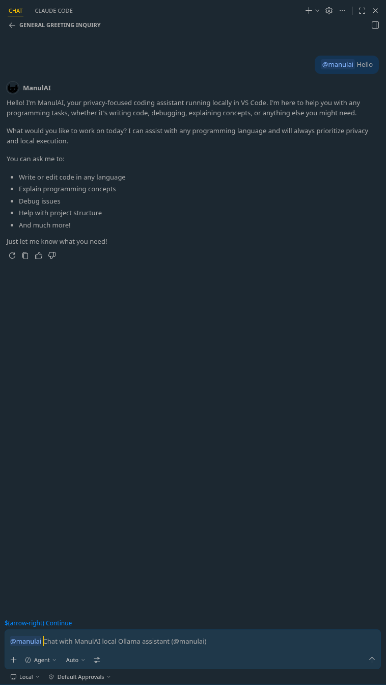
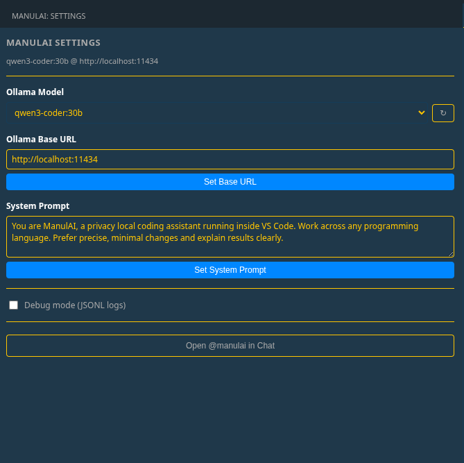

# ManulAI Local Agent


ManulAI is a **local AI coding assistant for VS Code** built on top of Ollama. It runs as a native Copilot Chat participant — no separate panels, just type `@manulai` in the Chat panel.



## Quick Start

```bash
ollama serve
ollama pull qwen3-coder:30b
```

Open VS Code, install the ManulAI extension, then open the Chat panel (`Ctrl+Alt+I` / `Cmd+Alt+I`) and type:

```text
@manulai hello
```

Streaming response appears token-by-token, including live **reasoning** blocks for thinking models.

## Modes

ManulAI supports three modes, switched via the `/setAgentMode` slash command:

- **Chat** — plain text only. Use it for explanation, review, and discussion. The model never claims to have edited files in this mode.
- **Agent** — the model may call file and terminal tools to edit files, run commands, and inspect the workspace.
- **Planner** — concise step-by-step responses with smaller deliberate actions; same tools as Agent Mode but a tighter mandate.

## Slash Commands

| Command | Description |
|---------|-------------|
| `/selectModel` | Open the model picker |
| `/model` | Show active model, agent mode, and auto-approve status |
| `/setAgentMode <chat\|agent\|planner>` | Switch agent mode |
| `/toggleAutoApprove` | Toggle auto-approve for tool calls |
| `/instructions` | Show loaded workspace agent instructions |
| `/skills` | Show loaded workspace skills |

## Workspace Agent Instructions

ManulAI automatically reads agent instruction files from your workspace and injects them into every chat request. Supported file names (searched in this order):

- `AGENTS.md`
- `CLAUDE.md`
- `.claude/AGENTS.md`
- `.claude/CLAUDE.md`
- `.github/copilot-instructions.md`
- `.cursorrules`
- `.ai/agents.md`
- `docs/AGENTS.md`
- `docs/CLAUDE.md`

Place an `AGENTS.md` in your project root to give the model context about your codebase conventions, architecture, or rules.

## Workspace Skills

ManulAI also reads **skills** from your workspace and injects them into every chat request. Skills are markdown files with YAML frontmatter (`name`, `description`) stored in:

- `.claude/skills/<skill-name>/SKILL.md`
- `skills/<skill-name>/SKILL.md`
- `.github/skills/<skill-name>/SKILL.md`
- `.ai/skills/<skill-name>/SKILL.md`

Example:

```markdown
---
name: my-project-rules
description: Guidelines for working with this codebase
---

# my-project-rules

1. Always use TypeScript strict mode.
2. Prefer functional components over class components.
```

Use `@manulai /skills` to see which skills are currently loaded.

## Settings

Click the **ManulAI** icon in the Activity Bar to open Settings:



The panel automatically fetches installed Ollama models from `/api/tags`. You can also:

- Update the Ollama base URL
- Edit the system prompt
- Toggle debug mode

The Settings view is also reachable via the **ManulAI: Open Settings** command.

## Local Ollama Integration

ManulAI talks to **your local Ollama runtime** through `/api/chat`. The extension is intentionally **Ollama-only** and does not add a cloud AI dependency.

- Default base URL: `http://localhost:11434`
- Validated baseline models: `phi4-mini:3.8b`, `llama3.1:8b`, `qwen3-coder:30b`, `gemma4:latest`, `gemma4:31b`
- `gemma4` models use a text-tool fallback because native tool calling is currently unreliable in Ollama for those thinking models

## Agent Tools

| Tool | Description |
|------|-------------|
| `read_active_file` | Read the currently open editor file |
| `read_specific_file` | Read full file contents |
| `read_file_slice` | Read a bounded line range |
| `create_or_edit_file` | Create or overwrite a file (`content` is required) |
| `replace_in_file` | Replace text in an existing file |
| `execute_terminal_command` | Run a shell command (no stdin) |
| `launch_in_terminal` | Open a VS Code terminal for interactive commands |
| `delete_file` | Delete a file |
| `list_workspace_files` | List files/folders in a directory |
| `project_scan` | Return a recursive tree of the workspace |

## Safety Controls

- **Recommended: `autoApprove = false`** for any workflow that can write files or run commands.
- **Manual approval** lets you gate tool execution before a file write or terminal action happens.
- **Command blocklist** rejects dangerous shell patterns: destructive deletes, pipe-to-shell installers, privileged commands, machine-level shutdown/reboot.
- **Debug JSONL logs** capture user requests, tool calls, fallback decisions, and runtime behavior under `.manulai/logs/` when `debugMode` is enabled.
- **Model-aware context trimming** keeps smaller local models usable by reducing context and tool scope instead of overwhelming them.
- **Safe editing behavior** prefers read-before-edit, bounded reads, targeted replacements, and visible tool output over blind rewrites.

## Build From Source

```bash
npm ci
npm run compile
npm run lint
npm run test
```

Standalone agent loop test harness (no VS Code required):

```bash
ollama serve
node scripts/debug-agent.mjs "your prompt"
```

## Links

- Marketplace: https://marketplace.visualstudio.com/items?itemName=manul-engine.manulai-local-agent
- Open VSX: https://open-vsx.org/extension/manul-engine/manulai-local-agent
- GitHub: https://github.com/alexbeatnik/ManulAI
- Developer docs: [README-dev.md](README-dev.md)

## What's New

- **0.0.15:** Model availability verification and loading resilience. Before every request, ManulAI now queries Ollama `/api/tags` to confirm the selected model is actually installed locally. If the model is missing, the user gets a clear "Model not found" message with instructions to pull the model or select a different one — instead of a cryptic HTTP 500. Added automatic retry with exponential backoff (3s / 5s / 7s, up to 3 retries) for transient Ollama HTTP 500/503 "model failed to load" / "model is loading" errors. If retries are exhausted, a user-friendly diagnostic message explains possible causes (insufficient RAM/VRAM, model still downloading, GPU contention) and suggests next steps. **Smart OOM fallback:** when a large model (15B+ parameters) fails to load due to memory limits, ManulAI automatically checks which smaller models are already installed and recommends them inline — e.g. "You already have smaller models installed: `qwen3-coder:8b`, `phi4-mini:3.8b`". If no smaller model is installed, it suggests lightweight alternatives with approximate RAM requirements. Covers both streaming chat and non-streaming compaction calls. **Read-loop prevention:** Added tracking of read files per session with early nudges when the model tries to read the same file twice. Redundant `list_workspace_files` calls are automatically blocked after `project_scan` since the full directory tree is already known. Auto-bootstrap triggers after 2 consecutive read-only turns: the agent injects a user message forcing the model to stop reading and create the requested file. This prevents models like `qwen3-coder:30b` from getting stuck in read loops instead of executing write operations. **Tool limit:** Maximum 3 tools per turn to prevent context explosion from models attempting to read dozens of files simultaneously. **Auto-generated plan UI:** When a model outputs tool calls without explanatory text, ManulAI automatically generates a human-readable plan from the tool calls and displays it in chat (e.g. "📖 Reading `README.md`", "📝 Creating `description.md`"). This gives users visibility into what the agent is doing even when the model itself doesn't narrate its actions. **Clean agent UI:** Raw tool JSON is hidden from chat in agent/planner modes; only human-friendly tool results are shown. **Cleanup release:** Removed the legacy webview-based provider (`src/ManulAiChatProvider.ts`, `src/manulBridge.ts`, all `provider*Utils.ts` files, `media/webview.html`, `media/manul_bridge_api.py`, `src/types.ts`) — about 17,000 lines of dead source/HTML/Python that the live VS Code Chat participant no longer references. The browser-automation `manul_*` tools shipped in 0.0.10 lived only in that legacy provider and are not part of the current build. Hardened the live tool dispatch in `src/agentExecutor.ts`: `create_or_edit_file` and `write_to_file` now reject calls where the model omitted the `content` field entirely (silently coercing missing content to `""` previously truncated the target file and let the model claim success on a destroyed target — empty files are still allowed when the model passes `content: ""` explicitly); `create_or_edit_file` now also auto-creates missing parent directories so greenfield writes like `src/index.ts` in a fresh project no longer ENOENT; `replace_in_file` now errors on multi-match and on identical `old_text`/`new_text` (a too-short `old_text` like `return 1` that matches both branches of an `if`/`else` previously silently corrupted unrelated code by replacing the first occurrence). Live agent loop in `src/copilotChatParticipant.ts` gained a refusal-detection nudge: when the user prompt contains action verbs (create/edit/rename/fix/etc.) and the model returns prose with zero tool calls before any tool has executed, the loop nudges once to force a real tool call instead of accepting "I can't access your files" as a final answer. The standalone test harness in `scripts/debug-agent.mjs` was hardened in the same change with brace-balanced JSON tool-call extraction (handles tool calls whose `content` strings contain literal `{` or `}`), an alt tool-call shape parser (`{"<tool_name>": {<args>}}`), malformed-tool-call detection plus a 3-strike bail, duplicate-write-loop bail (same `(tool, argsHash)` repeating more than twice), per-turn tool cap (`MAX_TOOLS_PER_TURN = 3` with write/terminal/read prioritisation, mirroring the live agent loop) and within-turn dedup so a single response that emits 20+ identical `read_specific_file` calls no longer blows up context, the same refusal-detection nudge, the strict multi-match `replace_in_file` semantics, the auto-mkdir behaviour, and a fix for spurious `STOP — Max turns reached` after a clean break. Packaging version updated to `0.0.15`.
- **0.0.14:** Full agent tool execution with human-friendly output. ManulAI now executes tools in Agent and Planner modes: `create_or_edit_file`, `replace_in_file`, `read_specific_file`, `execute_terminal_command`, and more. Tool results are shown in a human-readable format — created files display content with syntax highlighting, file edits show a diff view, and reads/terminal commands show concise summaries. Added automatic context-window management per model (256K for Gemma 4, 128K for Llama/Qwen, etc.) with history truncation. Workspace skills are now read from `.claude/skills/`, `skills/`, `.github/skills/`, and `.ai/skills/` directories and injected into the system prompt. Added loop detection to stop infinite tool-call cycles. Added interactive ✅ Approve / ❌ Decline buttons in chat for tool approval. Agent mode now defaults to auto-approve. Rewrote `scripts/debug-agent.mjs` to match the new architecture with streaming, tool execution, and context truncation. New source files: `src/agentExecutor.ts` (tool execution), `src/modelContextConfig.ts` (context window mapping), `src/skillsReader.ts` (skill discovery). Agent loop now stops immediately after any successful terminal command to prevent unnecessary post-completion reads and tool calls. Terminal command execution auto-retries `git push` with `--set-upstream` when the error indicates no upstream branch. Added debug JSONL logging to the Copilot Chat participant (`@manulai`) — when `debugMode` is enabled, detailed event logs are written to `.manulai/logs/YYYYMMDD-HHMMSS.jsonl` covering user requests, Ollama calls, tool executions, context trims, loop detection, and agent stops. Added conversation compaction: when the context window fills up, old history is summarized via Ollama into compact memory instead of being silently dropped, preserving critical context across long sessions. **Safety hardening:** Expanded command blocklist to cover `rm -rf` variants targeting system directories, `poweroff`, `halt`, `kill -9`, `pkill`, `killall`, `init 0/6`, `systemctl poweroff/reboot`, `dd of=/dev/`, device file writes, global package uninstalls, and more. Added a file-path guard that blocks writes, edits, and deletes targeting system paths, the home directory root, the workspace root, and critical project files (`.git/`, `package.json`, `tsconfig.json`, `Dockerfile`, `Cargo.toml`, `go.mod`, `.env`, `LICENSE`, `README.md`, `CLAUDE.md`, `AGENTS.md`, and 30+ others). **Model loading resilience:** Added automatic retry with exponential backoff for Ollama HTTP 500/503 "model failed to load" and "model is loading" errors. Packaging version updated to `0.0.14`.
- **0.0.13:** Copilot Chat integration and settings panel. ManulAI now registers as a native VS Code Chat participant (`@manulai`) so you can chat with your local Ollama model directly in the Copilot Chat panel. Streaming responses are rendered token-by-token, including live reasoning blocks extracted from `<think>` tags for thinking models. Added a dedicated Settings webview in the Activity Bar (`manulai.settings`) for quick access to model, base URL, agent mode, system prompt, auto-approve, and debug toggles. New source files: `src/copilotChatParticipant.ts` (chat participant handler), `src/settingsPanel.ts` (settings UI), and `src/ollamaStreamParser.ts` (streaming + reasoning extraction). Updated `src/extension.ts` and `package.json` to register the participant and views. Packaging version updated to `0.0.13`.
- **0.0.1 – 0.0.12:** Earlier alpha releases shipped a custom webview-based chat provider with browser-automation tools (`manul_*`), per-chat workspace notes, persisted chat sessions, and an extensive provider-side fallback layer for weak local models. That entire provider stack was retired in 0.0.15 in favor of the leaner VS Code Chat participant introduced in 0.0.13. Release-by-release notes for those versions remain in the git history.

## License

This project is licensed under the Apache License 2.0.
See the `LICENSE` file included in the extension package for details.
